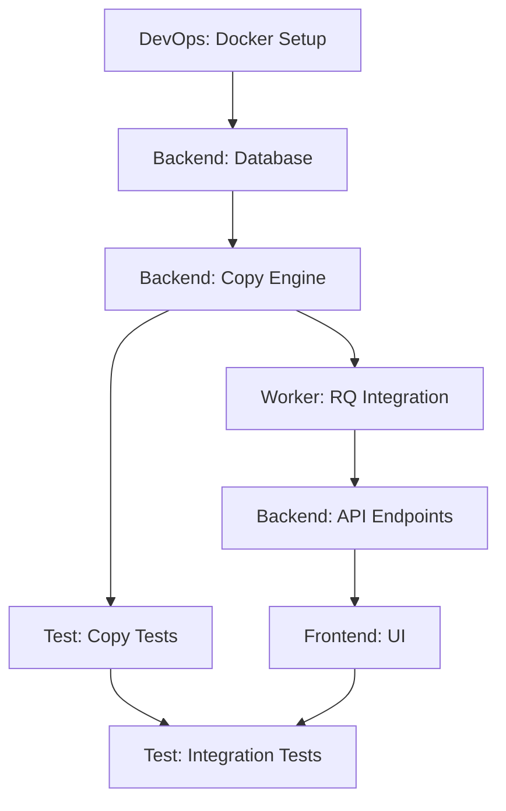

# Sistema Multi-Agente para Ketter 3.0

## Visão Geral

Sistema de agentes autônomos que constrói o Ketter 3.0 seguindo o timeline de 4 semanas, com cada agente responsável por uma área específica e atualizando o `state.md` após cada operação.

## Arquitetura de Agentes

```

                    ORCHESTRATOR AGENT                     
  (Coordena, valida dependências, atualiza state.md)      

                    
        
                                                   
              
    DevOps    Backend  Worker   Frontend Test  
     Agent     Agent    Agent    Agent   Agent 
            
```

## Agentes Especializados

### 1. **Orchestrator Agent** (Maestro)
**Responsabilidade:** Coordenação geral e gestão de estado

**Funções:**
- Lê CLAUDE.md e entende requisitos
- Cria e gerencia `state.md`
- Valida dependências entre agentes
- Distribui tarefas por semana/prioridade
- Verifica conclusão de milestones
- Garante que MRC principles são seguidos

**Saída:**
```markdown
# state.md
## Projeto: Ketter 3.0
## Status Geral: Week 1 - In Progress
## Última Atualização: 2025-11-04 15:30

### Week 1: Docker + Database + Copy Engine
- [] DevOps: Docker setup completo
- [⏳] Backend: Database schema - 60%
- [ ] Backend: Copy engine básico
- [ ] Test: Testes de cópia de 1 arquivo

### Próximas Ações:
1. Backend Agent deve completar schema (dependência: DevOps)
2. Backend Agent deve implementar copy engine
3. Test Agent aguarda copy engine
```

### 2. **DevOps Agent**
**Responsabilidade:** Infraestrutura e containerização

**Tarefas Week 1:**
- [ ] Criar `docker-compose.yml` com PostgreSQL, Redis, API, Worker
- [ ] Configurar volumes para persistência
- [ ] Setup de health checks
- [ ] Configurar networking entre containers
- [ ] Criar `.env.example` com variáveis necessárias
- [ ] Documentar comandos Docker

**Atualiza state.md:**
```markdown
## DevOps Agent - 2025-11-04 15:45
 Docker Compose configurado
 PostgreSQL rodando em porta 5432
 Redis rodando em porta 6379
 Health checks implementados
→ Backend Agent pode iniciar database setup
```

### 3. **Backend Agent**
**Responsabilidade:** API FastAPI e lógica de negócio

**Tarefas Week 1:**
- [ ] Criar estrutura de pastas (`app/`, `models/`, `services/`)
- [ ] Database schema (transfers, checksums, logs)
- [ ] Implementar Copy Engine com SHA-256 triplo
- [ ] Validação de espaço em disco
- [ ] Endpoints básicos para iniciar transfer

**Tarefas Week 2:**
- [ ] Completar API REST endpoints
- [ ] Integração com Worker RQ
- [ ] Error handling robusto
- [ ] Logging estruturado

**Atualiza state.md:**
```markdown
## Backend Agent - 2025-11-05 10:20
 Database schema criado (transfers, checksums, audit_logs)
 Copy Engine implementado: copy_with_verification()
 SHA-256: source_hash, destination_hash, final_verification
 Espaço em disco: implementado mas precisa teste com 500GB
→ Test Agent pode começar testes de copy engine
→ Worker Agent pode integrar copy engine
```

### 4. **Worker Agent**
**Responsabilidade:** Processamento assíncrono com RQ

**Tarefas Week 1-2:**
- [ ] Configurar RQ worker
- [ ] Job: `transfer_file_job(source, destination)`
- [ ] Callback para atualizar progresso no DB
- [ ] Retry policy para falhas de I/O
- [ ] Monitoramento de queue health

**Atualiza state.md:**
```markdown
## Worker Agent - 2025-11-06 14:00
 RQ Worker configurado e rodando
 Job transfer_file_job integrado com Copy Engine
 Retry policy: 3 tentativas com backoff exponencial
 Progress updates a cada 5% do arquivo
→ Backend Agent pode chamar jobs via API
→ Frontend Agent pode mostrar progresso
```

### 5. **Frontend Agent**
**Responsabilidade:** Interface React operador-friendly

**Tarefas Week 3:**
- [ ] Setup React com Vite
- [ ] Single-page operational view
- [ ] File/folder picker
- [ ] Progress bar com estimativa de tempo
- [ ] Transfer history (últimos 30 dias)
- [ ] Botão para download de PDF report

**Atualiza state.md:**
```markdown
## Frontend Agent - 2025-11-12 16:30
 React app inicializado com Vite
 Layout principal: file picker + progress + history
 Integração com API: POST /transfers, GET /transfers/history
 Progress bar atualiza via polling a cada 2s
 PDF download ainda não implementado (espera Report Agent)
→ Test Agent pode testar workflow end-to-end
```

### 6. **Test Agent**
**Responsabilidade:** Testes automatizados e validação

**Tarefas contínuas:**
- [ ] Testes unitários do Copy Engine (100% coverage)
- [ ] Testes de integração API + Worker
- [ ] Teste de cópia de 500GB real
- [ ] Teste de checksum com arquivo corrompido
- [ ] Teste de validação de espaço em disco
- [ ] Performance benchmarks

**Atualiza state.md:**
```markdown
## Test Agent - 2025-11-08 11:45
 Copy Engine: 100% test coverage
 Teste SHA-256: detecta corrupção de 1 byte em 10GB
 Teste espaço disco: bloqueia cópia se < 10% livre
 Teste 500GB: pendente (requer storage adequado)
→ Todos agentes: testes unitários passando
```

## Fluxo de Trabalho Multi-Agente

### Inicialização
```bash
# Orchestrator lê CLAUDE.md e cria state.md inicial
orchestrator init

# Orchestrator distribui tarefas Week 1
orchestrator assign --week 1
```

### Execução Autônoma
```python
# Cada agente executa em loop:
while not milestone_complete:
    task = get_next_task_from_state()
    result = execute_task(task)
    update_state_md(result)
    notify_orchestrator(result)
    check_dependencies()  # Pode desbloquear outros agentes
```

### Exemplo de Atualização de state.md

**Antes:**
```markdown
### Week 1 Progress: 45%
- [⏳] DevOps: Docker setup - 80%
- [ ] Backend: Database schema
```

**Depois (DevOps Agent completa):**
```markdown
### Week 1 Progress: 60%
- [] DevOps: Docker setup completo (2025-11-04 15:45)
  - Docker Compose funcional
  - PostgreSQL + Redis rodando
  - Health checks OK
- [⏳] Backend: Database schema - iniciado (2025-11-04 16:00)
  - Dependência DevOps satisfeita
  - Schema em andamento
```

## Dependências Entre Agentes



## Estrutura do state.md

```markdown
# Ketter 3.0 - Project State

## Metadata
- **Início:** 2025-11-04
- **Deadline Week 4:** 2025-12-02
- **Status Geral:** Week 1 - 60% complete

## Week 1: Docker + Database + Copy Engine
### Objetivo: Copy 1 file with checksum verification
- [] DevOps Agent
  - Docker Compose configurado
  - Containers rodando (postgres, redis, api, worker)
- [⏳] Backend Agent (75%)
  - Database schema completo
  - Copy Engine em progresso
- [ ] Test Agent (aguardando Copy Engine)

## Week 2: API + Worker (Not Started)
## Week 3: Frontend Web (Not Started)
## Week 4: Reports + Tests + Docs (Not Started)

## Blockers
- Nenhum

## Next Actions (Priority Order)
1. Backend Agent: Completar Copy Engine
2. Test Agent: Começar testes unitários
3. Worker Agent: Aguardar Copy Engine

## Métricas
- Commits: 12
- Tests Passing: 8/10
- Coverage: 85%
- LOC: 450 / target 2000

## Notas
- MRC principle mantido: simplicidade OK
- Docker robusto desde Day 1
- Zero workarounds até agora
```

## Implementação Técnica dos Agentes

### Opção 1: Python Multi-Processing
```python
# orchestrator.py
from multiprocessing import Process, Queue
from agents import DevOpsAgent, BackendAgent, WorkerAgent, FrontendAgent, TestAgent

def run_orchestrator():
    state = State("state.md")
    agents = [
        DevOpsAgent(state),
        BackendAgent(state),
        WorkerAgent(state),
        FrontendAgent(state),
        TestAgent(state)
    ]
    
    for week in range(1, 5):
        tasks = distribute_tasks(week, state)
        processes = [Process(target=agent.run, args=(tasks,)) for agent in agents]
        for p in processes:
            p.start()
        for p in processes:
            p.join()
        
        validate_milestone(week, state)
```

### Opção 2: AI Agents (LangChain/CrewAI)
```python
from crewai import Agent, Task, Crew

devops_agent = Agent(
    role="DevOps Engineer",
    goal="Setup Docker infrastructure for Ketter 3.0",
    backstory="Expert in containerization with focus on reliability",
    tools=[docker_tool, file_writer, state_updater]
)

backend_agent = Agent(
    role="Backend Developer",
    goal="Implement FastAPI + Copy Engine",
    backstory="Python expert focused on I/O operations",
    tools=[code_writer, test_runner, state_updater]
)

# Define tasks
task1 = Task(
    description="Create docker-compose.yml with PostgreSQL and Redis",
    agent=devops_agent,
    expected_output="Working Docker setup"
)

# Crew executes sequentially respecting dependencies
crew = Crew(agents=[devops_agent, backend_agent], tasks=[task1, task2])
result = crew.kickoff()
```

### Opção 3: Claude Code Multi-Instance (Mais Simples)
```bash
# terminal_orchestrator.sh
# Orquestra múltiplas instâncias do Claude Code

# Week 1
claude code "DevOps Agent: Crie Docker setup conforme CLAUDE.md Week 1. Atualize state.md ao finalizar"
claude code "Backend Agent: Aguarde DevOps. Então crie database schema. Atualize state.md"
claude code "Backend Agent: Implemente Copy Engine com SHA-256 triplo. Atualize state.md"
claude code "Test Agent: Teste Copy Engine com arquivo 1GB. Atualize state.md"
```

## Vantagens do Sistema Multi-Agente

1. **Paralelização:** DevOps e Backend podem trabalhar simultaneamente quando dependências satisfeitas
2. **Rastreabilidade:** `state.md` é fonte única de verdade
3. **Autonomia:** Cada agente sabe seu escopo e não interfere em outros
4. **Validação:** Test Agent roda continuamente
5. **Transparência:** Histórico completo de decisões em state.md

## Riscos e Mitigações

| Risco | Mitigação |
|-------|-----------|
| Agentes conflitam no state.md | Lock file ou merge estratégia |
| Dependências circulares | Orchestrator valida DAG antes |
| Agente trava | Timeout + fallback para manual |
| Decisões erradas | Test Agent valida continuamente |

## Monitoramento

```bash
# Dashboard em tempo real
watch -n 2 cat state.md

# Logs por agente
tail -f logs/devops_agent.log
tail -f logs/backend_agent.log

# Métricas
python metrics.py --show-progress
```

## Resultado Final

Após 4 semanas, o sistema multi-agente terá:
-  Código completo do Ketter 3.0
-  Todos testes passando
-  Docker funcionando
-  Documentação completa
-  `state.md` com histórico completo de desenvolvimento
-  Sistema pronto para produção

## Conclusão

Sim, é totalmente possível usar agentes para construir o Ketter 3.0 de forma automatizada. A chave é:

1. **Orquestração clara** via Orchestrator + state.md
2. **Agentes especializados** com responsabilidades bem definidas
3. **Dependências explícitas** no grafo de tarefas
4. **Validação contínua** via Test Agent
5. **Transparência total** no state.md

Isso permite que o projeto avance de forma autônoma, com cada agente contribuindo sua expertise e mantendo o estado global sincronizado.
